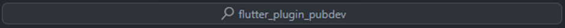
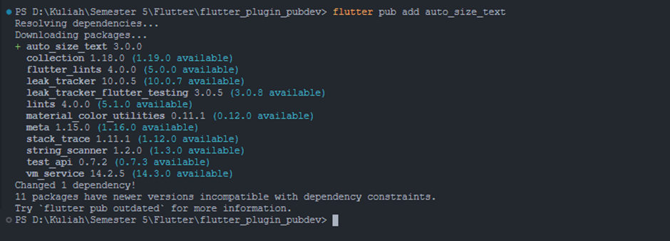
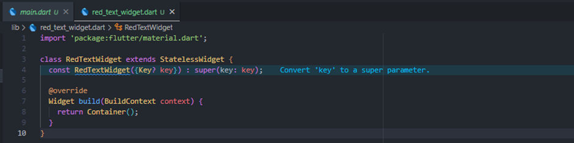
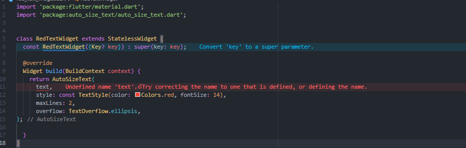
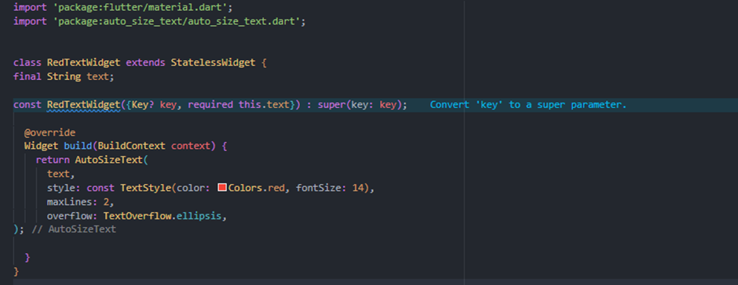
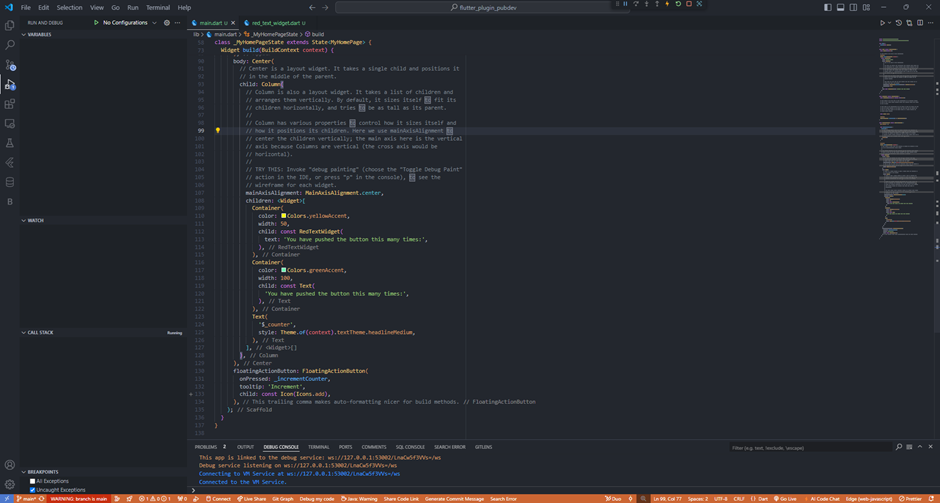
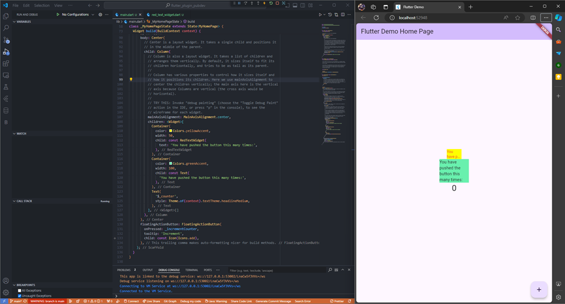

# TUGAS PRAKTIKUM PERTEMUAN 7
#  Manajemen Plugin   

### Nama : Cyndu Fathur Rohman
### Kelas : TI-3G
### No Absen : 10   

##### 1. Selesaikan Praktikum tersebut, lalu dokumentasikan dan push ke repository Anda berupa screenshot hasil pekerjaan beserta penjelasannya di file README.md!

##### Langkah 1: Buat Project Baru
Buatlah sebuah project flutter baru dengan nama flutter_plugin_pubdev. Lalu jadikan repository di GitHub Anda dengan nama flutter_plugin_pubdev.

##### Langkah 2: Menambahkan Plugin
Tambahkan plugin auto_size_text menggunakan perintah berikut di terminal

Jika berhasil, maka akan tampil nama plugin beserta versinya di file pubspec.yaml pada bagian dependencies.

##### Langkah 3: Buat file red_text_widget.dart
Buat file baru bernama red_text_widget.dart di dalam folder lib lalu isi kode seperti berikut.

##### Langkah 4: Tambah Widget AutoSizeText
Masih di file red_text_widget.dart, untuk menggunakan plugin auto_size_text, ubahlah kode return Container() menjadi seperti berikut.

Setelah Anda menambahkan kode di atas, Anda akan mendapatkan info error. Mengapa demikian? 
Variabel text belum diinisialisasi.

##### Langkah 5: Buat Variabel text dan parameter di constructor
Tambahkan variabel text dan parameter di constructor seperti berikut.

##### Langkah 6: Tambahkan widget di main.dart
Buka file main.dart lalu tambahkan di dalam children: pada class _MyHomePageState

Run aplikasi tersebut dengan tekan F5, maka hasilnya akan seperti berikut.

#### 2. Jelaskan maksud dari langkah 2 pada praktikum tersebut!
Fungsi kode dari langkah 2 adalah untuk menambahkan dependensi eksternal yang akan digunakan dalam project, yaitu plugin auto_size_text.
#### 3. Jelaskan maksud dari langkah 5 pada praktikum tersebut!
Tujuan dari langkah 5 adalah untuk membuat widget RedTextWidget menjadi dinamis dan menerima input teks dari luar melalui parameter. Variabel text akan digunakan untuk menampilkan teks yang dapat diubah sesuai kebutuhan saat instance widget ini digunakan dalam file main.dart. Penggunaan required pada parameter menunjukkan bahwa parameter tersebut harus diberikan nilai ketika widget ini diinstansiasi.
#### 4. Pada langkah 6 terdapat dua widget yang ditambahkan, jelaskan fungsi dan perbedaannya!
- Container pertama: Berwarna kuning dengan lebar 50 piksel, berisi widget RedTextWidget yang menggunakan plugin AutoSizeText. Teks di dalamnya otomatis menyesuaikan ukuran agar sesuai dengan lebar kontainer.

- Container kedua: Berwarna hijau dengan lebar 100 piksel, berisi widget Text bawaan Flutter yang menampilkan teks tanpa penyesuaian otomatis, sehingga teks bisa saja terpotong jika terlalu panjang.

#### 5. Jelaskan maksud dari tiap parameter yang ada di dalam plugin auto_size_text berdasarkan tautan pada dokumentasi ini !
- key: Mengontrol bagaimana widget diganti dalam pohon widget, berguna untuk menjaga status widget saat terjadi perubahan.

- textKey: Menetapkan key untuk widget teks yang dihasilkan, berguna untuk mengelola teks dalam pohon widget.

- style: Menerapkan gaya khusus (warna, ukuran font, dll.) ke teks. Jika tidak diatur, gaya default digunakan.

- minFontSize: Menyesuaikan ukuran minimum font saat auto-sizing text.

- maxFontSize: Menyesuaikan ukuran maximum font saat auto-sizing text.

- stepGranularity: Menentukan seberapa besar langkah perubahan ukuran font ketika disesuaikan otomatis.

- presetFontSizes: Menyediakan daftar ukuran font yang telah ditentukan. Ukuran font ini digunakan dalam urutan menurun.

- group: Menyinkronkan ukuran teks dari beberapa widget AutoSizeText sehingga ukurannya konsisten.

- textAlign: Menentukan perataan teks secara horizontal (kiri, kanan, tengah).

- textDirection: Menentukan arah teks (misalnya, kiri ke kanan atau kanan ke kiri).

- locale: Digunakan untuk memilih font ketika karakter Unicode yang sama dapat ditampilkan secara berbeda, tergantung pada lokal.

- softWrap: Menentukan apakah teks akan di wrapped pada soft line break .

- wrapWords: Menentukan apakah kata-kata yang tidak pas dalam satu baris akan di wrapped. Default-nya adalah true.

- overflow: Menentukan bagaimana teks overflow akan ditampilkan, seperti dipotong atau disingkat.

- overflowReplacement: Widget yang ditampilkan jika teks overflow dan tidak muat di area yang tersedia.

- textScaleFactor: Faktor skala untuk ukuran font, juga mempengaruhi minFontSize, maxFontSize, dan presetFontSizes.

- maxLines: Menetapkan jumlah maksimum baris yang dapat ditampilkan untuk teks.

- semanticsLabel: Label semantik alternatif untuk teks ini.